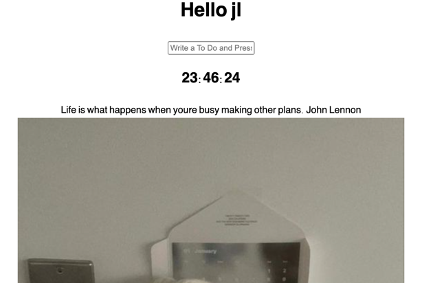

# 노마드 코더 JS 실습하기

## 바닐라 JS로 크롬앱 만들기
## 

### 기능 1. 사용자가 이름 입력해 로그인하면 localStorage에 저장해 " Hello 이름 " 띄워주기

### 기능 2. TO DO LIST 구현하기

기능 2-1. 입력한 투두 localStorage에 배열로 저장힉
기능 2-2. 삭제 버튼 누르면 해당 투두 삭제되게 하기

### 기능 3. 현재 시간 띄워주기

기능 3-1. Date.now() 사용

### 기능 4. 명언 배열 랜덤으로 사용자에게 보여주기

### 기능 5. 랜덤으로 사진 보여주기
